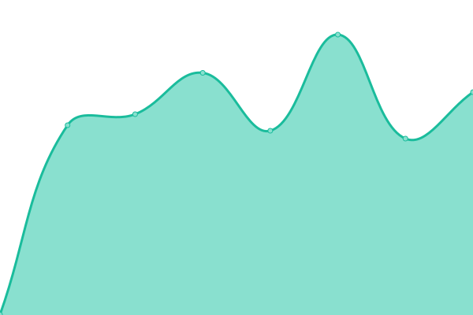
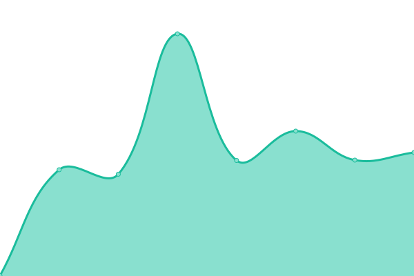
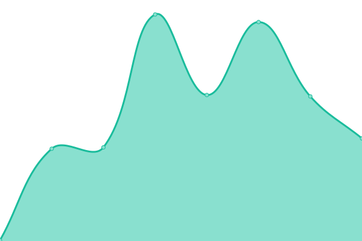

# [📈 Live Status](https://rlsoftwaredev.github.io/uptimechecker): <!--live status--> **🟩 All systems operational**

This repository contains the open-source uptime monitor and status page for [rlsoftwaredev](https://rlsoftwaredev.github.io/uptimechecker), powered by [Upptime](https://github.com/upptime/upptime).

With [Upptime](https://upptime.js.org), you can get your own unlimited and free uptime monitor and status page, powered entirely by a GitHub repository. We use [Issues](https://github.com/rlsoftwaredev/uptimechecker/issues) as incident reports, [Actions](https://github.com/rlsoftwaredev/uptimechecker/actions) as uptime monitors, and [Pages](https://rlsoftwaredev.github.io/uptimechecker) for the status page.

<!--start: status pages-->
<!-- This summary is generated by Upptime (https://github.com/upptime/upptime) -->
<!-- Do not edit this manually, your changes will be overwritten -->
<!-- prettier-ignore -->
| URL | Status | History | Response Time | Uptime |
| --- | ------ | ------- | ------------- | ------ |
|  [wasabich](https://wasabisushi.ch) | 🟩 Up | [wasabich.yml](https://github.com/RLSoftwareDev/uptimechecker/commits/HEAD/history/wasabich.yml) | 

 608ms
     
 | 

<a href="https://rlsoftwaredev.github.io/uptimechecker/history/wasabich">100.00%</a>
    

|  [wwwwasabich](https://www.wasabisushi.ch) | 🟩 Up | [wwwwasabich.yml](https://github.com/RLSoftwareDev/uptimechecker/commits/HEAD/history/wwwwasabich.yml) | 

 364ms
     
 | 

<a href="https://rlsoftwaredev.github.io/uptimechecker/history/wwwwasabich">100.00%</a>
    

|  [wasabi-sushibar](https://www.wasabi-sushibar.com) | 🟩 Up | [wasabi-sushibar.yml](https://github.com/RLSoftwareDev/uptimechecker/commits/HEAD/history/wasabi-sushibar.yml) | 

 377ms
     
 | 

<a href="https://rlsoftwaredev.github.io/uptimechecker/history/wasabi-sushibar">100.00%</a>
    

|  [wwwwasabisushibar](https://www.wasabi-sushibar.com) | 🟩 Up | [wwwwasabisushibar.yml](https://github.com/RLSoftwareDev/uptimechecker/commits/HEAD/history/wwwwasabisushibar.yml) | 

 259ms
     
 | 

<a href="https://rlsoftwaredev.github.io/uptimechecker/history/wwwwasabisushibar">100.00%</a>
    

<!--end: status pages-->

[**Visit our status website →**](https://rlsoftwaredev.github.io/uptimechecker)

## 📄 License

- Powered by: [Upptime](https://github.com/upptime/upptime)
- Code: [MIT](./LICENSE) © [Anand Chowdhary](https://anandchowdhary.com), supported by [Pabio](https://pabio.com)
- Data in the `./history` directory: [Open Database License](https://opendatacommons.org/licenses/odbl/1-0/)
